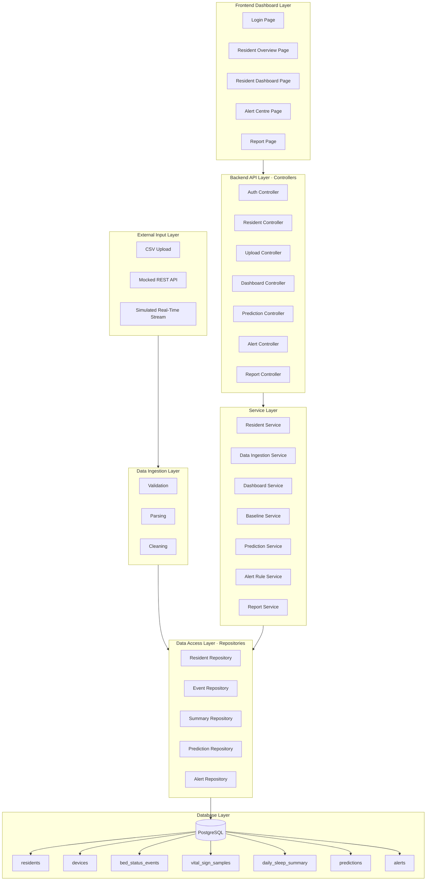
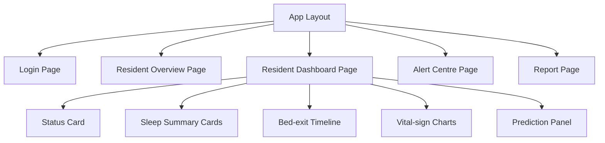

# COMP9900 Sleep Monitoring Dashboard — System Design

> Consolidated from `proposal_backend_section.md`, `proposal_storyboard_section.md`, `docs/design.md`, and `proposal-reference.pdf`.

---

## 1. Project overview

A **decision-support prototype** for carers and family members. The system ingests three types of sleep-monitoring device data:

| Data type | Core fields |
|---|---|
| Bed status events | `resident_id`, `timestamp`, `bed_status`, `activity_status`, `confidence` |
| Vital sign samples | `resident_id`, `timestamp`, `heart_rate_bpm`, `breathing_rate_per_min`, `confidence` |
| Daily sleep summary | `date`, `sleep_score`, `total_sleep_minutes`, `sleep_efficiency`, `bed_exit_count`, `avg_heart_rate`, `avg_breathing_rate`, etc. |

In the MVP, data enters via **CSV upload**. The same ingestion path can later switch to a mocked REST API or simulated stream without changing downstream business logic.

---

## 2. Technology stack

| Layer | Technology | Responsibility |
|---|---|---|
| Frontend | React + TypeScript + Vite + Recharts | Dashboard, charts, alerts, reports |
| Backend | Python FastAPI + SQLAlchemy | REST API, business logic, alert and prediction orchestration |
| Database | PostgreSQL 16 | Persistent storage |
| Analytics | Pandas / NumPy / scikit-learn | Baseline calculation, rule-based prediction, alert engine |
| Environment | Conda `comp9900` | Isolated Python dependencies |

---

## 3. System architecture

### 3.1 Two primary data flows

1. **Ingestion flow**: CSV / mocked API → validation / parsing / cleaning → Repository → PostgreSQL
2. **Frontend request flow**: React → Controller → Service → Repository → PostgreSQL → response returned on the same path

The database does not push data directly to the frontend. All reads are mediated by the service layer.

### 3.2 Backend layering

```
Controller (HTTP routing, authentication, input validation)
    ↓
Service (business logic, cross-module orchestration)
    ↓
Repository (SQL read/write)
    ↓
PostgreSQL

Analytics Layer (baseline, prediction, alert rules) ← invoked at service boundary
```

| Layer | Responsibility |
|---|---|
| Controller | Route dispatch, auth checks, HTTP status codes |
| Service | Dashboard aggregation, baseline, alerts, prediction, reports |
| Repository | Pure SQL; no business rules |
| Analytics | Feature extraction, probability prediction, rule engine |

### 3.3 Frontend page structure

```
App Layout
├── Login Page
├── Resident Overview Page      ← GET /api/residents
├── Resident Dashboard Page     ← GET /api/residents/{id}/dashboard
│   ├── Status Card
│   ├── Sleep Summary Cards
│   ├── Bed-exit Timeline
│   ├── Vital-sign Charts
│   └── Prediction Panel        ← GET /api/residents/{id}/prediction
├── Alert Centre Page           ← GET /api/alerts + POST /api/alerts/{id}/acknowledge
└── Report Page                 ← GET /api/reports/{resident_id}
```

### 3.4 Architecture diagrams

**Figure 1 — Overall system architecture**



**Figure 2 — Frontend component hierarchy**



---

## 4. Database schema

| Table | Purpose |
|---|---|
| `residents` | Residents (R001, R002, … — de-identified) |
| `devices` | Device-to-resident bindings |
| `bed_status_events` | Bed in/out events |
| `vital_sign_samples` | Heart rate and breathing rate samples |
| `daily_sleep_summary` | Daily sleep aggregates |
| `predictions` | Persisted prediction results |
| `alerts` | Alert records (includes `acknowledged` status) |
| `users` | Login users (MVP mock auth) |

---

## 5. REST API catalogue

| Endpoint | Method | Sprint | Description |
|---|---|---|---|
| `/api/health` | GET | 1 | Health check |
| `/api/auth/login` | POST | 1 | User login |
| `/api/residents` | GET | 1 | Resident list (status, alert count, risk level) |
| `/api/upload/bed-events` | POST | 1 | Upload bed-event CSV |
| `/api/upload/vitals` | POST | 1 | Upload vital-sign CSV |
| `/api/upload/sleep-summary` | POST | 1 | Upload daily sleep summary CSV |
| `/api/residents/{id}/dashboard` | GET | 2 | Dashboard summary data |
| `/api/residents/{id}/prediction` | GET | 2 | Bed-exit risk prediction |
| `/api/residents/{id}/alerts` | GET | 2 | Per-resident alert history |
| `/api/alerts` | GET | 2 | Global alert list (Alert Centre) |
| `/api/alerts/{id}/acknowledge` | POST | 2 | Acknowledge alert |
| `/api/reports/{resident_id}` | GET | 3 | Daily / weekly report data |

### Key response formats

**Prediction** — `{ probability, risk_level, windows: [{ minutes, probability, risk_level }], explanation }`

- `risk_level`: `Low` | `Medium` | `High`
- `explanation`: human-readable reason string

**Alert** — `{ alert_type, severity, reason, timestamp, suggested_action, acknowledged }`

- `severity`: `Low` | `Medium` | `High`

---

## 6. Business rules summary

### 6.1 Baseline service

- Computes rolling **7-day** and **30-day** averages per resident
- Feeds alert thresholds and prediction features — not fixed population defaults

### 6.2 Alert rules (six types)

1. Out-of-bed duration exceeds resident baseline
2. Bed-exit count abnormally high vs 30-day average
3. Sustained heart rate / breathing rate deviation from individual range
4. No person detected during scheduled sleep hours
5. Low device confidence (`confidence < 0.5`)
6. High bed-exit prediction risk

Each alert includes `reason` and `suggested_action`.

### 6.3 Prediction module

- Probability windows: 15 / 30 / 60 minutes
- Risk levels: **Low / Medium / High**
- Must include a readable `explanation` field

---

## 7. Design decisions

| Subproblem | Chosen approach | Alternatives | Rationale |
|---|---|---|---|
| Data ingestion without real hardware | CSV upload + mocked API | Real-time device integration | MVP feasible; client allows simulated data |
| Personalised abnormality detection | 7/30-day resident baseline | Fixed population thresholds | Reduces false alarms; more accurate per individual |
| Bed-exit prediction | Interpretable rules + statistical features | LSTM / Transformer | Explainable for carers in MVP |
| Alert triggering | Sustained-pattern rules | Single-reading alerts | Avoids alarm fatigue |
| Backend architecture | FastAPI layered architecture | Monolithic backend | Easier testing and module integration |
| Communication | REST API | WebSocket / GraphQL | Pull-based dashboard; simpler to debug |

**Innovation relative to generic monitoring products**: per-resident rolling baselines applied consistently to both alerting and prediction, plus embedded `explanation` output so carers understand risk ratings without interpreting a black-box score.

---

## 8. Security and ethics

- Dashboard, alert, and prediction endpoints require login; unauthenticated requests return HTTP 401
- Upload endpoints validate field formats and plausible ranges
- Demo data uses anonymous IDs (R001, R002, R003); no PII
- Frontend displays a non-medical-diagnosis disclaimer on relevant pages
- Prototype is decision support only — not a substitute for professional clinical judgement

---

## 9. Local development

```bash
# 1. Conda environment
conda activate comp9900

# 2. Database (port 5433)
docker compose up -d

# 3. Backend
cd backend && pip install -r requirements.txt
python scripts/init_db.py      # create tables + seed demo data
uvicorn app.main:app --reload --port 8000

# 4. Frontend
cd frontend && npm install && npm run dev
```

- Backend docs: http://localhost:8000/docs
- Frontend: http://localhost:5173
- Default login: `admin` / `admin123`

Reset demo data:

```bash
python backend/scripts/init_db.py --reset
```

---

## 10. Repository layout

```
sprint1-en/
├── DESIGN.md                 # This document
├── IMPLEMENTATION.md         # Implemented features reference
├── docker-compose.yml
├── environment.yml
├── backend/
│   ├── app/
│   │   ├── main.py
│   │   ├── config.py
│   │   ├── database.py
│   │   ├── models/
│   │   ├── schemas/
│   │   ├── repositories/
│   │   ├── services/
│   │   ├── analytics/
│   │   └── routers/
│   ├── scripts/
│   │   └── init_db.py
│   └── requirements.txt
├── frontend/
│   └── src/
│       ├── pages/
│       ├── components/
│       └── api/
└── docs/
```

---

## 11. Sprint delivery plan

| Sprint | Backend | Frontend |
|---|---|---|
| 1 | Auth + Upload + Residents | Login + Resident Overview |
| 2 | Dashboard + Prediction + Alerts | Dashboard (5 components) + Alert Centre |
| 3 | Reports + aggregation polish | Report page + filter enhancements |

> **Note:** This `sprint1-en` package includes the full MVP (Sprints 1–3 scope) as a runnable deliverable. See [IMPLEMENTATION.md](./IMPLEMENTATION.md) for the exact implemented feature list.
