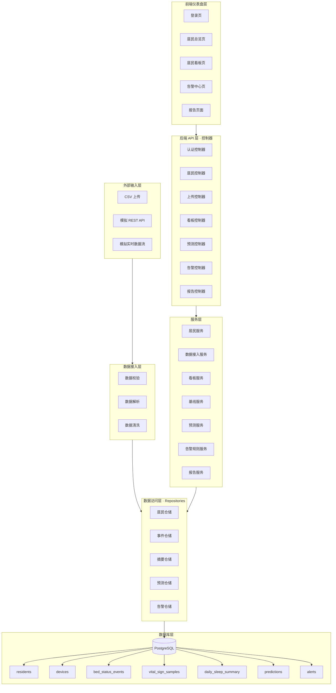
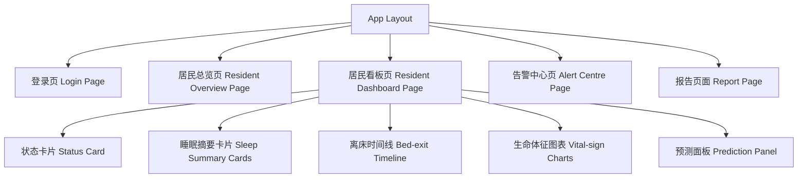
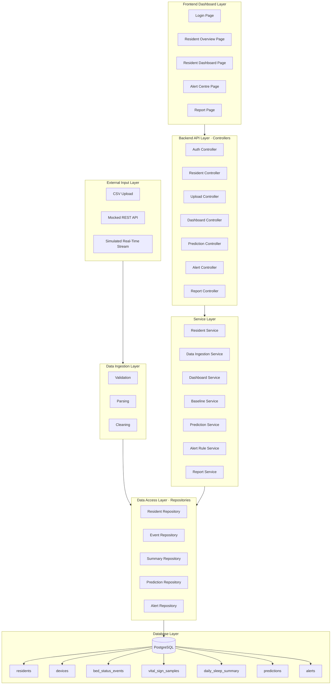
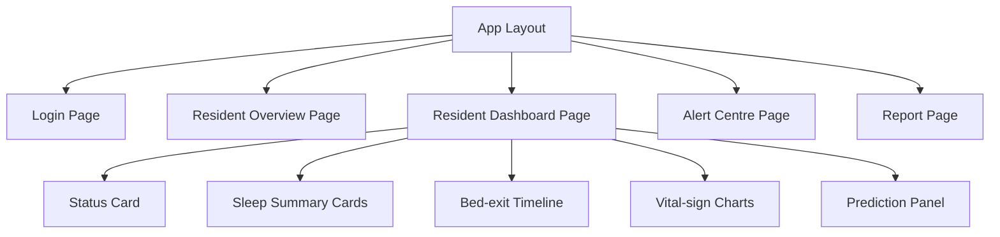

# 3. 技术设计

## 3.1 系统架构图

本项目处理三类来自睡眠监测设备的数据：离床/在床事件（bed status events）、生命体征样本（vital sign samples）和每日睡眠摘要（daily sleep summary）。这三类数据在 MVP 阶段通过 CSV 上传进入系统，后续可切换为模拟 REST API 或实时数据流，而不需要改动下游逻辑。最终，这些数据需要以看板、告警和报告的形式呈现给护理人员和家属。

后端夹在数据来源和前端之间，职责涉及三块：接收并校验原始数据、执行业务逻辑（基线比对、告警判断、报告聚合），以及调用 Wenxiang 负责的预测模块后将结果规范化返回。如果把这些混在一起写，Sprint 2 同时上线预测和告警时会很快变得难以维护，所以后端按 `控制器 -> 服务 -> 数据访问` 分层，并把预测与告警的计算部分从 API 路由中独立出去。

系统存在两条主要数据流：**数据接入流**从外部输入层经数据接入层流向数据访问层，最终写入 PostgreSQL；**前端请求流**从前端出发，经后端控制器到服务层，再通过数据访问层（Repositories）读写数据库，结果沿原路返回前端。数据库不直接将结果推送给前端，所有读取均经由服务层和控制器中转。

架构图关键交互：
- 前端通过 REST 调用后端控制器，控制器不含业务逻辑，只做路由分发与认证检查
- 服务层调用预测服务、告警规则服务，结果通过数据访问层写入 `predictions` 和 `alerts` 表
- 前端展示数据时，由控制器调用服务层读取，而非直接查询数据库

**图 1**：整体系统架构（Mermaid）

前端各页面与后端 API 的交互通过 REST 调用完成，前端内部的组件结构如下图所示。居民看板页是前端最复杂的一级，下挂状态卡片、睡眠摘要卡片组、离床时间线、生命体征图表和预测面板五个子组件，其余页面（总览、告警中心、报告页面）均为独立的一级页面，均由 App Layout 统一承载路由。

**图 2**：前端组件层级结构

---

## 3.4 后端分层设计与 API 设计

后端按 `控制器 -> 服务 -> 数据访问` 组织，另外单独引出一个分析层与 Wenxiang 的预测模块对接。这四层的职责划分如下表所示：

**表 1. 后端分层职责**

| 分层 | 主要职责 |
|---|---|
| 控制器层（Controller Layer） | 处理 HTTP 请求、认证检查、状态码返回 |
| 服务层（Service Layer） | 承载业务逻辑与跨模块编排 |
| 数据访问层（Data Access Layer） | 在 PostgreSQL 中执行查询、插入、更新 |
| 分析层（Analytics Layer） | 执行基线计算、风险预测与告警规则 |

### 控制器层

控制器层只做入口工作：路由分发、入参格式检查和认证状态验证，然后调用对应的服务方法并返回响应码。以上传控制器为例，它需要区分离床事件、生命体征、睡眠摘要三种上传格式，并在调用数据接入服务之前拒掉格式明显不符的请求。控制器本身不判断数据是否异常，也不直接查库。

### 服务层

服务层承载所有业务判断，比较典型的有以下几块：

- **看板服务**：从 `daily_sleep_summary` 读取 `sleep_score`、`total_sleep_minutes`、`sleep_efficiency`、`bed_exit_count`、`avg_heart_rate`、`avg_breathing_rate`，并从 `bed_status_events` 取最新一条记录拼出当前 `bed_status`（IN_BED / OUT_OF_BED / NO_PERSON）。
- **基线服务**：按居民 ID 计算近 7 天和近 30 天的滚动均值，为告警规则服务和预测服务提供个体化参考阈值，而不是依赖固定的群体标准。
- **告警规则服务**：实现六类告警规则，包括离床持续时间超出基线、30 天内离床次数异常增加、心率/呼吸率持续偏离个体范围、睡眠期间未检测到人员以及设备置信度过低（`confidence` 字段低于阈值）等，同时为每条告警附上 `reason` 和 `suggested_action`。
- **预测服务**：封装预测调用，统一输出 `{probability, risk_level, explanation}` 格式，其中 `risk_level` 取低 / 中 / 高，`explanation` 是对当次风险原因的可读说明（例如"该居民通常在此时段起床，且近 10 分钟 activity_status 由 STATIC 转为 ACTIVE"）。

这些判断放在服务层而不是控制器里，好处是后续调整告警阈值或替换预测模型时，路由和前端都不需要改动。

### 数据访问层

数据访问层基于仓储模式（repository pattern），统一管理对 PostgreSQL 的读写。核心表包括  
`residents`、`devices`、`bed_status_events`、`vital_sign_samples`、`daily_sleep_summary`、`predictions`、`alerts`。  
这一层只负责执行 SQL，不做任何业务判断——业务变了改服务层，表结构变了改这里，互不干扰。

### 分析模块集成

离床风险预测所用的特征包括当前时段、近期 `activity_status` 变化趋势、`heart_rate_bpm` 偏离基线幅度、近 30 天 `bed_exit_count` 均值等，这些字段由 Hanyue 的数据层提供，Wenxiang 的预测模块消费。后端通过服务层边界调用，拿到 `probability` 和 `explanation` 后做格式封装，再返回给前端或存入 `predictions` 表。这个接口边界让预测模块和后端 API 层可以分别测试，第二阶段联调时不会相互阻塞。

---

### API 设计

接口设计的优先目标是把主要功能点都覆盖到，让前端可以按接口契约独立开发，不用等后端真实逻辑跑通。

**表 2. REST API 接口清单**

| 接口路径（Endpoint） | 方法（Method） | 功能说明 |
|---|---|---|
| `/api/auth/login` | POST | 用户登录 |
| `/api/residents` | GET | 获取居民列表 |
| `/api/residents/{id}/dashboard` | GET | 获取居民看板汇总数据 |
| `/api/upload/bed-events` | POST | 上传离床/在床事件数据 |
| `/api/upload/vitals` | POST | 上传心率与呼吸率数据 |
| `/api/upload/sleep-summary` | POST | 上传每日睡眠摘要 |
| `/api/residents/{id}/prediction` | GET | 获取离床风险预测 |
| `/api/residents/{id}/alerts` | GET | 获取告警历史 |
| `/api/alerts/{id}/acknowledge` | POST | 确认告警 |
| `/api/reports/{resident_id}` | GET | 获取日报/周报数据 |

这十个接口覆盖了居民监测、数据上传、风险预测、告警管理与报告生成五条主线。第一阶段优先交付认证、三类上传和居民列表接口；第二阶段接入预测和告警；第三阶段补全报告与多居民总览，开发顺序和接口边界一一对应。

值得一提的是两个响应格式：`/api/residents/{id}/prediction` 返回 `probability`（数值型概率）、`risk_level`（低 / 中 / 高）和 `explanation`（可读的风险原因字符串，例如"该居民通常在此时段起床，且近 10 分钟 `activity_status` 由 STATIC 转为 ACTIVE"）；`/api/residents/{id}/alerts` 返回的每条告警包含 `alert_type`、`severity`、`reason`、`timestamp` 和 `suggested_action`，前端可直接渲染。

---

## 3.6 设计论证

本节将系统的核心设计决策拆解为若干子问题，逐一说明所选方案、备选方案及选择依据。

**表 3. 设计决策子问题汇总**

| 子问题 | 提出方案 | 备选方案 | 选择理由 |
|---|---|---|---|
| 无真实硬件时的数据接入 | CSV 上传 + 模拟 API | 真实设备实时接入 | MVP 阶段可行；客户明确允许模拟数据 |
| 个体化异常检测 | 居民 7/30 天滚动基线 | 固定群体阈值 | 减少误报率，更贴近个体实际状况 |
| 离床预测 | 可解释机器学习 + 规则特征 | LSTM / Transformer | MVP 阶段更易实现，结果对护理人员可解释 |
| 告警触发策略 | 持续模式告警规则 | 单次读数触发 | 避免告警疲劳，提高信噪比 |
| 后端架构 | FastAPI 分层架构 | 单体后端 | 便于单元测试与模块集成 |
| 通信协议 | REST API | WebSocket / GraphQL | 看板以查询操作为主，REST 简单够用 |

框架选 FastAPI，主要是因为这个项目的后端不只是转发请求，还要对接基线计算和预测模块——这两块都是 Python 写的。FastAPI 和 Pandas、NumPy、scikit-learn 在同一个生态里，集成起来省很多力气；加上它自带 OpenAPI 文档，开发阶段前后端对接口格式有争议时可以直接对照文档，不用靠口头沟通。

接口风格选 REST 而不是 WebSocket 或 GraphQL，原因比较直接：护理人员看板的使用场景基本是"点击查询"，不是高频推送，REST 的请求-响应模式够用，而且调试方便，用 Postman 跑几个请求就能验证。更重要的是，前后端都在赶进度，用 REST 可以更早定好接口格式，让 Qiuyue 的前端和后端并行推进，不互相等待。

分层这件事，看似增加了代码量，但这个项目到第二阶段会同时上线告警规则、预测接口和报告功能，如果早期没有分层，后面很容易在一个文件里堆出几百行混杂了路由、SQL 和业务规则的代码。分层之后，每个部分边界清楚，写单元测试也容易——测服务层不用启动数据库，测数据访问层不用管业务逻辑。

另外有一点值得说：数据库和前端的数据格式要求往往会在开发过程中微调，把它们的交互都集中在服务层编排，意味着这些变化通常只需要改一个地方，不会扩散到控制器或前端调用层。

本系统在既有居家监护产品基础上的创新点在于：将个体化滚动基线（而非固定群体阈值）同时用于告警规则和预测特征；将可解释性输出（`explanation` 字段）直接内嵌在预测结果里，让护理人员在看到风险评级的同时能理解原因，而不依赖黑盒模型输出。

---

## 3.7 安全、隐私与伦理边界

本项目是决策支持原型，不接真实医疗系统，安全设计的重点是"边界清晰，不做过度工程"。

- **身份认证**：看板、告警、预测等接口均要求登录态，未认证请求返回 401。最小可行版本可先用简化的模拟认证，但接口结构保持一致，正式版替换时不需要改路由。
- **输入校验**：三类上传接口各有校验规则。以离床事件为例：`bed_status` 必须是 IN_BED / OUT_OF_BED / NO_PERSON 之一，`timestamp` 需符合 `YYYY-MM-DD HH:MM:SS` 格式，`resident_id` 须在 `residents` 表中存在；`confidence` 字段若低于预设阈值，记录被标注为低置信度而非直接丢弃，供告警规则服务判断是否触发设备数据质量告警。
- **演示数据去标识化**：演示数据集使用 R001、R002 等匿名标识，不包含真实姓名、身份证号或联系方式。
- **非医疗诊断声明**：系统输出的风险等级和告警仅用于辅助护理人员决策，不构成医疗诊断。这一点在前端展示侧也应明确标注，避免误用。
- **伦理边界**：本原型系统仅作为辅助决策工具，不得用于替代专业临床判断（The prototype is a decision-support tool only and must not be used as a substitute for professional clinical judgement）。

---

# English Version (Translation)

## 3. Technical Design

## 3.1 System Architecture Diagram

The system handles three types of sleep-device data: bed status events (fields: `resident_id`, `timestamp`, `bed_status`, `activity_status`, `confidence`), vital sign samples (`heart_rate_bpm`, `breathing_rate_per_min`, `confidence`), and daily sleep summaries (`sleep_score`, `total_sleep_minutes`, `sleep_efficiency`, `bed_exit_count`, `avg_heart_rate`, `avg_breathing_rate`, among others). In the MVP, all three types arrive via CSV upload; the same ingestion path is designed to support a mocked REST API or simulated stream later with no changes to the service layer downstream.

The backend sits between these data sources and the frontend. Its responsibilities span three areas: validating and storing incoming records, running business logic (baseline comparison, alert rule evaluation, report aggregation), and wrapping prediction outputs from Wenxiang's module into a standard response format. Mixing these responsibilities would make Sprint 2 very hard to manage once alerting, prediction, and reporting all land at the same time — so we structured the backend as `Controller -> Service -> Data Access`, with the analytics/prediction boundary sitting alongside the service layer.

The architecture has two main data flows. The **ingestion flow** runs from the external input layer through the data ingestion layer, then through the data access layer (repositories) into PostgreSQL. The **frontend request flow** starts at the frontend, passes through the API controllers to the service layer, then through the data access layer to read or write the database, and returns via the same path. The database does not push results directly to the frontend — all reads are mediated by the service and controller layers.

Key interactions to show:
- The frontend calls backend controllers via REST; controllers handle routing and authentication only, with no business logic
- The service layer invokes prediction and alert rule logic; results are persisted through the data access layer into `predictions` and `alerts` tables
- When the frontend requests dashboard or report data, controllers call the service layer which reads through repositories — not directly from the database

**Figure 1**: Overall System Architecture (Mermaid)

The frontend communicates with the backend exclusively through REST calls. Within the frontend, the Resident Dashboard Page is the most structurally complex route, decomposed into five child components: a Status Card, Sleep Summary Cards, a Bed-exit Timeline, Vital-sign Charts, and a Prediction Panel. All top-level pages — Login, Resident Overview, Resident Dashboard, Alert Centre, and Report — are mounted under a shared App Layout that handles routing.

**Figure 2**: Frontend Component Hierarchy

## 3.4 Backend Layer Design and API Design

The backend is structured around a `Controller -> Service -> Data Access` spine, with an additional analytics integration layer for connecting to Wenxiang's prediction module. The responsibilities of each layer are summarised in the table below.

**Table 1. Backend Layer Responsibilities**

| Layer | Responsibility |
|---|---|
| Controller Layer | Handle HTTP requests, auth checks, and response codes |
| Service Layer | Implement business logic and orchestration |
| Data Access Layer | Execute query/insert/update in PostgreSQL |
| Analytics Layer | Run baseline calculation, prediction, and alert rules |

### Controller Layer

The controller layer handles entry-point concerns only: routing, format checks, authentication, and returning HTTP responses. The Upload Controller, for example, distinguishes between three CSV formats and rejects malformed requests before anything reaches the Data Ingestion Service. No business logic or database access happens here, which makes problems easier to isolate during testing.

### Service Layer

Business logic lives entirely in the service layer. A few concrete examples:

- **Dashboard Service**: reads `sleep_score`, `total_sleep_minutes`, `sleep_efficiency`, `bed_exit_count`, `avg_heart_rate`, and `avg_breathing_rate` from `daily_sleep_summary`, and fetches the latest `bed_status` (IN_BED / OUT_OF_BED / NO_PERSON) from `bed_status_events` to build the dashboard response.
- **Baseline Service**: computes rolling 7-day and 30-day averages per resident, feeding personalised thresholds into both the Alert Rule Service and the Prediction Service — avoiding population-level defaults that would be less accurate for individual residents.
- **Alert Rule Service**: evaluates six alert types — out-of-bed duration exceeding the resident's baseline, repeated bed exits above the 30-day average, sustained `heart_rate_bpm` or `breathing_rate_per_min` deviation, unexpected absence during scheduled sleep hours, and low-`confidence` device readings — and attaches `reason` and `suggested_action` to every triggered alert.
- **Prediction Service**: wraps the model output into `{probability, risk_level, explanation}`, where `risk_level` is Low / Medium / High and `explanation` is a readable string, e.g. "This resident typically gets up at this hour; `activity_status` has shifted from STATIC to ACTIVE in the past 10 minutes."

Keeping this logic in the service layer means alert thresholds and prediction models can be updated without touching routing or frontend code.

### Data Access Layer

The data access layer uses a repository pattern for all PostgreSQL interactions. Core tables: `residents`, `devices`, `bed_status_events`, `vital_sign_samples`, `daily_sleep_summary`, `predictions`, `alerts`. Nothing here makes business decisions — it just runs the queries.

### Analytics Integration

Prediction features include current time window, recent `activity_status` trend, `heart_rate_bpm` deviation from baseline, and 30-day `bed_exit_count` average — fields supplied by Hanyue's data layer and consumed by Wenxiang's prediction module. The backend calls this through a defined service boundary, normalises the output, and either returns it to the frontend or stores it in the `predictions` table. Both sides can develop and test against this interface independently, which avoids blocking dependencies during Sprint 2.

### API Design

The main goal of the API design is to cover all major features so the frontend can develop against a fixed contract without waiting for backend logic to be complete.

**Table 2. REST API Endpoints**

| Endpoint | Method | Purpose |
|---|---|---|
| `/api/auth/login` | POST | User login |
| `/api/residents` | GET | Get resident list |
| `/api/residents/{id}/dashboard` | GET | Get resident dashboard summary |
| `/api/upload/bed-events` | POST | Upload bed in/out events |
| `/api/upload/vitals` | POST | Upload heart-rate and breathing-rate samples |
| `/api/upload/sleep-summary` | POST | Upload daily sleep summary |
| `/api/residents/{id}/prediction` | GET | Get bed-exit risk prediction |
| `/api/residents/{id}/alerts` | GET | Get alert history |
| `/api/alerts/{id}/acknowledge` | POST | Acknowledge alert |
| `/api/reports/{resident_id}` | GET | Get daily/weekly report data |

These ten endpoints span resident monitoring, data upload, risk prediction, alert management, and reporting. The delivery order maps naturally onto the sprint plan: authentication and the three upload endpoints in Sprint 1, prediction and alerting in Sprint 2, reports and multi-resident overview in Sprint 3.

Two response formats are worth calling out specifically. `/api/residents/{id}/prediction` returns `probability`, `risk_level` (Low / Medium / High), and `explanation` — a human-readable string describing why the risk is elevated, such as "This resident typically gets up at this hour; `activity_status` has shifted from STATIC to ACTIVE in the past 10 minutes." `/api/residents/{id}/alerts` returns each alert with `alert_type`, `severity`, `reason`, `timestamp`, and `suggested_action`, which the frontend can render directly without further processing.

## 3.6 Design Justifications

The following table breaks the system's core design decisions into subproblems, listing the chosen solution, alternatives considered, and the rationale for each choice.

**Table 3. Design Decision Summary**

| Subproblem | Proposed Solution | Alternatives Considered | Justification |
|---|---|---|---|
| Data ingestion from non-real hardware | CSV upload + mocked API | Real-time device integration | MVP feasible; client allows simulated data |
| Personalised abnormality detection | 7/30-day resident baseline | Fixed population thresholds | Reduces false alarms; more accurate per individual |
| Bed-exit prediction | Interpretable ML + rule-based features | LSTM / Transformer | More feasible and explainable for MVP |
| Alerting | Sustained-pattern alert rules | Single-reading alerts | Avoids alarm fatigue; improves signal-to-noise ratio |
| Backend architecture | FastAPI layered architecture | Monolithic backend | Easier testing and integration |
| Communication | REST API | WebSocket / GraphQL | Simpler and sufficient for a pull-based dashboard |

We chose FastAPI primarily because this backend does more than forward requests — it needs to interface with baseline calculation and prediction modules, both of which are written in Python. FastAPI sits in the same ecosystem as Pandas, NumPy, and scikit-learn, so wiring them together takes much less effort than it would with a different stack. The built-in OpenAPI documentation is also useful during development: whenever there is a disagreement about a response format, both sides can consult the live docs rather than relying on informal communication.

REST was chosen over WebSocket or GraphQL because the carer dashboard is mostly a pull-based interface — users click to query rather than receive constant pushes. REST's request-response model is sufficient for this pattern and is much easier to test with tools like Postman. More importantly, agreeing on REST endpoints early lets Qiuyue's frontend work proceed in parallel with the backend, which matters when both sides are under the same deadline.

The layered structure adds some initial boilerplate, but without it, Sprint 2 would likely end up with a few large files mixing routing, SQL, and business rules together. Once alerting, prediction, and reports all land in the same codebase, untangling them becomes expensive. Separating the layers also makes unit testing more practical: service logic can be tested without a running database, and data-access code can be tested without spinning up the full application.

One further point worth noting: database schemas and frontend data formats tend to drift during development. Routing all interactions through the service layer means these adjustments usually touch one place rather than cascading into controllers or frontend call sites.

The novel contribution of this system relative to existing aged-care monitoring products lies in two areas: applying a per-resident rolling baseline (rather than fixed population thresholds) consistently across both alerting and prediction features, and embedding human-readable `explanation` output directly in prediction results so carers can understand the reason behind a risk rating without interpreting a black-box score.

## 3.7 Security, Privacy and Ethical Boundaries

This is a decision-support prototype rather than a production clinical system, so security is designed to cover the necessary boundaries without over-engineering.

- **Authentication**: Dashboard, alert, and prediction endpoints all require an authenticated session; unauthenticated requests return 401. For MVP a simplified mock auth is acceptable, provided the endpoint structure remains identical to the production design so the switch requires no routing changes.
- **Input Validation**: Each of the three upload endpoints has its own validation rules. For bed events: `bed_status` must be one of IN_BED / OUT_OF_BED / NO_PERSON, `timestamp` must match `YYYY-MM-DD HH:MM:SS`, and `resident_id` must exist in the `residents` table. For vitals: `heart_rate_bpm` and `breathing_rate_per_min` are checked for plausible ranges. The `confidence` field across all three types is not discarded if low — instead the record is flagged, giving the Alert Rule Service the information it needs to trigger a device data quality alert.
- **No PII in Demo Data**: Demo datasets use identifiers such as R001 and R002. No real names, ID numbers, or contact details are included.
- **Not Medical Diagnosis**: The system's risk levels and alerts are decision support for carers, not clinical judgements. This boundary should be stated explicitly on the frontend as well, to prevent misuse.
- **Ethical Boundary**: The prototype is a decision-support tool only and must not be used as a substitute for professional clinical judgement.
