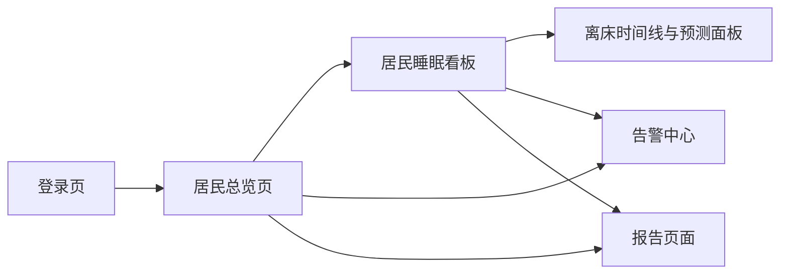
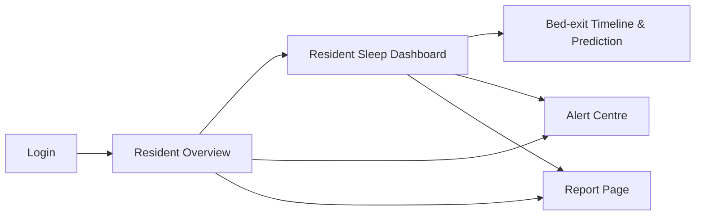

# 3.2 界面故事板（Interface Storyboarding）

> **草稿说明 / Draft Notes**
> 1. **PROJ issue key**：下文所有 PROJ-1、PROJ-2、PROJ-15 等编号为占位符，须在 Jira 看板确认后统一替换。
> 2. **语言**：最终提交的 proposal 报告仅保留英文版，中文部分仅供草稿参考，正式提交前删除。

本系统是一个面向护理人员和家属的仪表盘原型，用户交互以"查看-筛选-确认"为主要操作模式。以下五个故事板覆盖系统的全部核心功能流程，页面间的导航关系如下图所示：



---

## 故事板 1：登录页与居民总览

**覆盖用户故事**：PROJ-1、PROJ-2、PROJ-15

### 页面描述

**登录页**位于系统入口。页面居中布局，包含用户名输入框、密码输入框和登录按钮。输入错误凭据时，页面原地显示错误提示而不跳转，避免用户困惑。成功登录后跳转至居民总览页。

**居民总览页**是护理人员进入系统后的默认落点。页面以网格卡片形式展示所有在监居民，每张卡片包含以下信息：

- 居民姓名与 ID
- 当前床位状态（IN_BED / OUT_OF_BED / NO_PERSON），以色块区分——绿色表示在床，黄色表示离床，灰色表示未检测到人员
- 最近一次数据更新时间
- 当前活跃告警数量与最高告警等级（若有）
- 当前离床风险等级（低 / 中 / 高）

页面顶部提供按告警状态和风险等级快速筛选的入口，方便护理人员优先关注高风险居民。点击任意居民卡片进入其睡眠看板页面。

```
┌─────────────────────────────────────────────────────────┐
│  系统名称                              [告警中心] [退出] │
├─────────────────────────────────────────────────────────┤
│  筛选：[全部] [有活跃告警] [高风险]                      │
├───────────────┬───────────────┬───────────────┬─────────┤
│ 居民 R001     │ 居民 R002     │ 居民 R003     │   ...   │
│ ● 在床        │ ● 离床 12分钟 │ ● 未检测到    │         │
│ 告警：1 条    │ 告警：0 条    │ 告警：2 条    │         │
│ 风险：低      │ 风险：中      │ 风险：高      │         │
│ 更新：02:14   │ 更新：02:31   │ 更新：02:08   │         │
└───────────────┴───────────────┴───────────────┴─────────┘
```

---

## 故事板 2：居民睡眠看板

**覆盖用户故事**：PROJ-4、PROJ-6、PROJ-8

### 页面描述

居民睡眠看板是单个居民的核心信息页面。页面顶部显示当前状态区，中部展示今晚睡眠摘要，下部排列两张趋势图表和历史对比区。

**顶部状态区**以大色块卡片显示当前床位状态（IN_BED / OUT_OF_BED / NO_PERSON），同时标注最后更新时间和当前活动状态（STATIC / ACTIVE）。

**睡眠摘要区**排列六项指标卡片：

- **睡眠评分**（`sleep_score`）：78
- **总睡眠时长**（`total_sleep_minutes`）：432 分钟
- **睡眠效率**（`sleep_efficiency`）：86%
- **离床次数**（`bed_exit_count`）：2 次
- **平均心率**（`avg_heart_rate`）：72 bpm
- **平均呼吸率**（`avg_breathing_rate`）：16 次/分

**趋势图区**包含两张折线图：心率趋势图（`heart_rate_bpm` 随时间变化）和呼吸率趋势图（`breathing_rate_per_min` 随时间变化），横轴为当晚时间，图上叠加显示基线参考区间（个体近 30 天均值 ± 波动范围）。

**历史对比区**展示近 7 天和近 30 天的睡眠时长、睡眠效率、离床次数均值，供护理人员判断本晚是否异常。

```
┌─────────────────────────────────────────────────────────┐
│  ← 返回总览    居民 R001                                  │
├─────────────────────────────────────────────────────────┤
│  [● 在床  STATIC  最后更新：02:14]                        │
├──────┬──────────┬──────┬──────────┬──────────┬──────────┤
│ 评分 │ 睡眠时长 │ 效率 │ 离床次数 │ 平均心率 │ 平均呼吸 │
│  78  │  432分   │ 86%  │   2次    │  72 bpm  │ 16次/分  │
├─────────────────────────────────────────────────────────┤
│  心率趋势                          呼吸率趋势            │
│  [折线图 + 基线区间]               [折线图 + 基线区间]    │
├─────────────────────────────────────────────────────────┤
│  历史对比：近7天均值 / 近30天均值                         │
└─────────────────────────────────────────────────────────┘
```

---

## 故事板 3：离床时间线与风险预测面板

**覆盖用户故事**：PROJ-7、PROJ-12、PROJ-13

### 页面描述

本页面作为居民睡眠看板的扩展标签页，专门展示今晚离床事件详情与未来风险预测。

**离床时间线**以横向时间轴呈现今晚各次离床和回床事件，每段离床区间标注开始时间、结束时间和持续时长，超出该居民基线的时段以醒目颜色高亮。

**风险预测面板**固定在页面右侧或底部，包含三个时间窗口的预测结果：

- 未来 15 分钟：概率 0.18，风险等级**低**
- 未来 30 分钟：概率 0.43，风险等级**中**
- 未来 60 分钟：概率 0.71，风险等级**高**

面板下方显示 `explanation` 字段内容，例如："该居民通常在 02:00–03:00 之间起床，当前 `activity_status` 已由 STATIC 转为 ACTIVE，心率较基线偏高约 8 bpm。"

风险等级以色标区分：绿色（低）、橙色（中）、红色（高）。

```
┌───────────────────────────────┬─────────────────────────┐
│  今晚离床时间线                │  离床风险预测            │
│                               │                         │
│  22:00 ──────────────── 06:00 │  15分钟：18%  ● 低      │
│         [离床 01:23–01:35]    │  30分钟：43%  ● 中      │
│         [离床 03:11–03:28 ▲]  │  60分钟：71%  ● 高      │
│         （超出基线，12分钟）   │                         │
│                               │  原因说明：              │
│                               │  该居民通常在此时段起床  │
│                               │  当前 activity_status   │
│                               │  已转为 ACTIVE，心率偏高 │
└───────────────────────────────┴─────────────────────────┘
```

---

## 故事板 4：告警中心

**覆盖用户故事**：PROJ-10、PROJ-11、PROJ-13

### 页面描述

告警中心汇总全部居民的告警记录，护理人员可在此集中处理和确认告警。

**告警列表区**以时间倒序排列所有告警，每条告警显示：

- 告警类型（如"离床时间过长"、"心率持续偏高"、"未检测到人员"等）
- 告警等级（高 / 中 / 低），以色标显示
- 居民姓名与 ID
- 触发时间戳
- 原因说明（`reason` 字段）

**筛选栏**支持按告警等级、居民和时间范围过滤，方便值班护理人员快速定位需要处理的告警。

**告警详情**点击任一告警后，右侧展开详情面板，显示完整原因说明、建议操作（`suggested_action`）和"确认告警"按钮。确认后该告警在列表中标记为已处理，不影响历史记录查询。

```
┌─────────────────────────────────────────────────────────┐
│  告警中心                               [返回总览]       │
├─────────────────────────────────────────────────────────┤
│  筛选：[全部等级 ▼] [全部居民 ▼] [时间范围 ▼]           │
├──────────────────────────────────┬──────────────────────┤
│ ● 高  离床时间过长    R003  02:08 │ 告警详情             │
│      超出基线约 23 分钟           │ 类型：离床时间过长    │
│                                  │ 居民：R003           │
│ ● 中  心率持续偏高    R001  01:44 │ 时间：02:08          │
│      连续 8 分钟偏离基线 +12bpm   │ 原因：超出基线23分钟  │
│                                  │ 建议：前往查看        │
│ ● 低  设备置信度低    R002  00:53 │                      │
│      confidence < 0.5，持续3条   │ [确认告警]           │
└──────────────────────────────────┴──────────────────────┘
```

---

## 故事板 5：报告页面

**覆盖用户故事**：PROJ-14、PROJ-16

### 页面描述

报告页面面向需要查看趋势的护理人员和家属，提供日报和周报两种视图。

**日报视图**展示指定日期的睡眠摘要，包含 `sleep_score`、`total_sleep_minutes`、`awake_minutes`、`sleep_efficiency`、`bed_exit_count`、`longest_out_of_bed_minutes`、`avg_heart_rate`、`avg_breathing_rate`，以卡片形式排列。

**周报视图**以折线图展示近 7 天的以下指标趋势：

- 每日睡眠时长（`total_sleep_minutes`）
- 每日睡眠效率（`sleep_efficiency`）
- 每日离床次数（`bed_exit_count`）
- 每日平均心率与平均呼吸率

每张图叠加该居民近 30 天基线均值作为参考线，帮助家属直观判断近期睡眠质量是否有变化趋势。

页面右上角提供"导出 PDF"或"打印"按钮（如进度允许）。

```
┌─────────────────────────────────────────────────────────┐
│  居民 R001 · 睡眠报告          [日报] [周报]  [导出PDF] │
├─────────────────────────────────────────────────────────┤
│  日期选择：◀ 2026-06-09 ▶                                │
├──────┬────────┬────────┬──────┬────────┬────────┬───────┤
│ 评分 │  睡眠  │  清醒  │ 效率 │  离床  │  心率  │ 呼吸  │
│  78  │ 432分  │  42分  │ 86%  │   2次  │ 72bpm  │16次/分│
├─────────────────────────────────────────────────────────┤
│  近7天趋势：睡眠时长 / 睡眠效率 / 离床次数 / 生命体征    │
│  [折线图 × 4，各含30天基线参考线]                        │
└─────────────────────────────────────────────────────────┘
```

---

# English Version

# 3.2 Interface Storyboarding

> **Draft Notes**
> 1. **PROJ issue keys**: All issue keys such as PROJ-1, PROJ-2, PROJ-15, etc. are provisional placeholders and must be updated once the Jira board is finalised.
> 2. **Language**: The final submitted proposal should retain the English version only. The Chinese section above is for draft reference and should be removed before final submission.

This system is a dashboard prototype for aged-care staff and family members. The primary interaction pattern is view–filter–acknowledge. The five storyboards below cover all major functional flows. Page navigation is illustrated in the diagram below.



---

## Storyboard 1: Login and Resident Overview

**Covered user stories**: PROJ-1, PROJ-2, PROJ-15

### Page Description

The **login page** is the system entry point. It presents a centred layout with a username field, password field, and login button. Invalid credentials produce an inline error message without redirecting. On success, the user is taken to the resident overview.

The **resident overview** is the default landing page after login. It displays all monitored residents as a grid of cards. Each card shows:

- Resident name and ID
- Current bed status (IN_BED / OUT_OF_BED / NO_PERSON) with colour coding — green for in bed, yellow for out of bed, grey for no person detected
- Timestamp of last data update
- Active alert count and highest severity level (if any)
- Current bed-exit risk level (Low / Medium / High)

A filter bar at the top lets staff quickly narrow the view to residents with active alerts or high risk. Clicking any card opens that resident's sleep dashboard.

```
┌─────────────────────────────────────────────────────────┐
│  System Name                       [Alert Centre] [Logout]│
├─────────────────────────────────────────────────────────┤
│  Filter: [All] [Active Alerts] [High Risk]               │
├───────────────┬───────────────┬───────────────┬─────────┤
│ Resident R001 │ Resident R002 │ Resident R003 │   ...   │
│ ● In Bed      │ ● Out 12 min  │ ● No Person   │         │
│ Alerts: 1     │ Alerts: 0     │ Alerts: 2     │         │
│ Risk: Low     │ Risk: Medium  │ Risk: High    │         │
│ Updated: 02:14│ Updated: 02:31│ Updated: 02:08│         │
└───────────────┴───────────────┴───────────────┴─────────┘
```

---

## Storyboard 2: Resident Sleep Dashboard

**Covered user stories**: PROJ-4, PROJ-6, PROJ-8

### Page Description

The resident sleep dashboard is the main information page for a single resident. The top section shows current status; the middle section shows tonight's sleep summary; the bottom section holds trend charts and a historical comparison.

The **status banner** uses a large colour-coded card to display the current bed status (IN_BED / OUT_OF_BED / NO_PERSON), along with the last update time and current activity state (STATIC / ACTIVE).

The **sleep summary section** presents six metric cards:

- **Sleep score** (`sleep_score`): 78
- **Total sleep** (`total_sleep_minutes`): 432 min
- **Sleep efficiency** (`sleep_efficiency`): 86%
- **Bed-exit count** (`bed_exit_count`): 2
- **Average heart rate** (`avg_heart_rate`): 72 bpm
- **Average breathing rate** (`avg_breathing_rate`): 16 /min

The **trend chart section** contains two line charts: heart rate (`heart_rate_bpm` over time) and breathing rate (`breathing_rate_per_min` over time), with the resident's 30-day baseline range overlaid as a reference band.

The **historical comparison section** shows 7-day and 30-day averages for sleep duration, efficiency, and bed-exit count, giving carers context to judge whether tonight is unusual.

```
┌─────────────────────────────────────────────────────────┐
│  ← Back to Overview    Resident R001                     │
├─────────────────────────────────────────────────────────┤
│  [● In Bed  STATIC  Last updated: 02:14]                 │
├──────┬────────┬────────┬───────────┬──────────┬─────────┤
│Score │ Sleep  │Effic.  │ Bed-exits │ Avg HR   │Avg BR   │
│  78  │ 432min │  86%   │   2       │ 72 bpm   │ 16 /min │
├─────────────────────────────────────────────────────────┤
│  Heart-rate trend              Breathing-rate trend      │
│  [Line chart + baseline band]  [Line chart + baseline]   │
├─────────────────────────────────────────────────────────┤
│  Historical comparison: 7-day avg / 30-day avg           │
└─────────────────────────────────────────────────────────┘
```

---

## Storyboard 3: Bed-Exit Timeline and Risk Prediction Panel

**Covered user stories**: PROJ-7, PROJ-12, PROJ-13

### Page Description

This page is an extended tab within the resident sleep dashboard, dedicated to tonight's bed-exit events and near-term prediction.

The **bed-exit timeline** is a horizontal time axis covering tonight's sleep window. Each out-of-bed interval is marked with start time, end time, and duration. Intervals that exceed the resident's personal baseline are highlighted in a distinct colour.

The **risk prediction panel** sits on the right side of the page and shows predictions across three time windows:

- Next 15 minutes: probability 0.18, risk level **Low**
- Next 30 minutes: probability 0.43, risk level **Medium**
- Next 60 minutes: probability 0.71, risk level **High**

Below the prediction results, the `explanation` field is displayed in plain text — for example: "This resident typically gets up between 02:00 and 03:00. Current `activity_status` has shifted from STATIC to ACTIVE, and heart rate is approximately 8 bpm above baseline."

Risk levels use consistent colour coding: green (Low), orange (Medium), red (High).

```
┌───────────────────────────────┬─────────────────────────┐
│  Tonight's Bed-exit Timeline  │  Bed-exit Risk Prediction│
│                               │                         │
│  22:00 ──────────────── 06:00 │  15 min: 18%  ● Low     │
│         [Out 01:23–01:35]     │  30 min: 43%  ● Medium  │
│         [Out 03:11–03:28 ▲]   │  60 min: 71%  ● High    │
│         (exceeds baseline,    │                         │
│          12 min over)         │  Reason:                │
│                               │  Resident usually gets  │
│                               │  up at this time;       │
│                               │  activity_status ACTIVE,│
│                               │  HR above baseline      │
└───────────────────────────────┴─────────────────────────┘
```

---

## Storyboard 4: Alert Centre

**Covered user stories**: PROJ-10, PROJ-11, PROJ-13

### Page Description

The alert centre consolidates all alert records across residents. Staff can review, filter, and acknowledge alerts from a single page.

The **alert list** is sorted in reverse chronological order. Each entry shows:

- Alert type (e.g. "Long out-of-bed event", "Sustained abnormal vital signs", "No person detected")
- Severity (High / Medium / Low) with colour indicator
- Resident name and ID
- Trigger timestamp
- Summary of the `reason` field

The **filter bar** supports filtering by severity, resident, and time range, making it easy for on-duty staff to find unacknowledged or high-priority items.

Clicking an alert opens a **detail panel** on the right showing the full reason, the `suggested_action`, and an "Acknowledge" button. Acknowledged alerts are marked as resolved in the list but remain in the history for audit purposes.

```
┌─────────────────────────────────────────────────────────┐
│  Alert Centre                        [Back to Overview] │
├─────────────────────────────────────────────────────────┤
│  Filter: [All Severity ▼] [All Residents ▼] [Date ▼]    │
├──────────────────────────────────┬──────────────────────┤
│ ● High  Long out-of-bed  R003  02:08│ Alert Detail      │
│         23 min over baseline     │ Type: Long out-of-bed│
│                                  │ Resident: R003       │
│ ● Med   High HR sustained R001 01:44│ Time: 02:08       │
│         8 min, +12 bpm above base│ Reason: 23 min over  │
│                                  │ Action: Check resident│
│ ● Low   Low confidence   R002  00:53│                   │
│         confidence < 0.5, 3 rows │ [Acknowledge]        │
└──────────────────────────────────┴──────────────────────┘
```

---

## Storyboard 5: Report Page

**Covered user stories**: PROJ-14, PROJ-16

### Page Description

The report page is aimed at carers and family members who want to review sleep trends over time. It offers a daily view and a weekly view.

The **daily view** presents a summary for a selected date, showing `sleep_score`, `total_sleep_minutes`, `awake_minutes`, `sleep_efficiency`, `bed_exit_count`, `longest_out_of_bed_minutes`, `avg_heart_rate`, and `avg_breathing_rate` as metric cards.

The **weekly view** shows seven-day trend line charts for:

- Daily sleep duration (`total_sleep_minutes`)
- Daily sleep efficiency (`sleep_efficiency`)
- Daily bed-exit count (`bed_exit_count`)
- Daily average heart rate and breathing rate

Each chart overlays the resident's 30-day baseline as a reference line, so family members can easily see whether recent sleep quality is trending up or down.

An "Export PDF" or "Print" button is placed in the top-right corner and will be implemented if schedule allows.

```
┌─────────────────────────────────────────────────────────┐
│  Resident R001 · Sleep Report    [Daily] [Weekly] [Export]│
├─────────────────────────────────────────────────────────┤
│  Date: ◀ 2026-06-09 ▶                                    │
├──────┬────────┬───────┬───────┬────────┬────────┬───────┤
│Score │ Sleep  │ Awake │Effic. │B-exits │ Avg HR │ Avg BR│
│  78  │ 432min │ 42min │  86%  │   2    │ 72 bpm │16/min │
├─────────────────────────────────────────────────────────┤
│  7-day trends: Sleep duration / Efficiency /             │
│  Bed-exit count / Vital signs                            │
│  [4 line charts, each with 30-day baseline overlay]      │
└─────────────────────────────────────────────────────────┘
```
